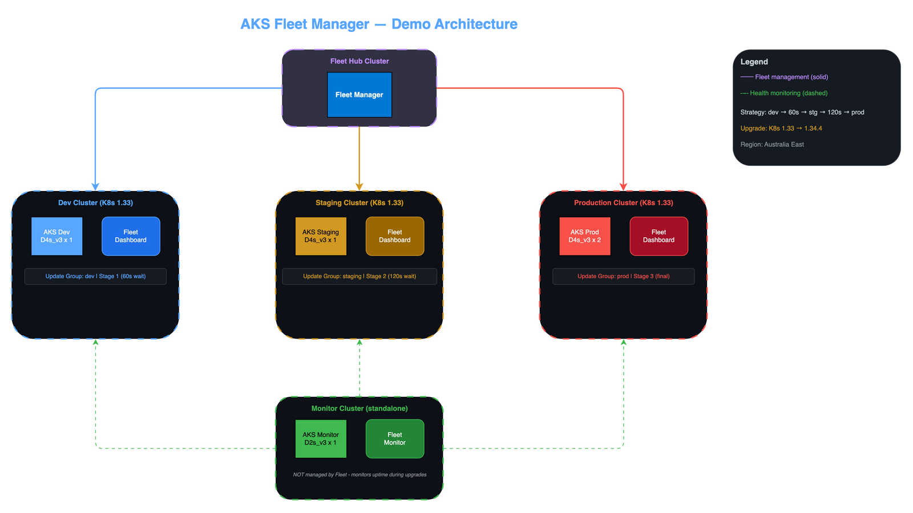

# AKS Fleet Manager Demo (Hubless Mode)

Multi-cluster Kubernetes management demo using AKS Fleet Manager **without a hub cluster**. Demonstrates coordinated update orchestration across dev → staging → production with zero-downtime upgrades.



## 🎯 Hub vs Hubless — When to Use Each

| Capability | With Hub | Without Hub (this lab) |
|---|---|---|
| **Update orchestration** | ✅ | ✅ |
| **Staged rollouts** | ✅ | ✅ |
| **Resource propagation (CRP)** | ✅ | ❌ |
| **Cross-cluster networking** | ✅ | ❌ |
| **Multi-cluster services** | ✅ | ❌ |
| **Hub cluster cost** | ~$1.50/day | $0 |
| **Complexity** | Higher | Lower |

**Use hubless when:** You only need coordinated upgrades across clusters — no workload propagation or cross-cluster networking. This is the most common enterprise scenario.

## 🏗️ Architecture

```
                    ┌──────────────────────────────┐
                    │     AKS Fleet Manager         │
                    │     (No Hub Cluster)          │
                    │  ┌─────────────────────────┐  │
                    │  │  Update Orchestration    │  │
                    │  │  Staged Rollout Engine   │  │
                    │  │  (Control Plane Only)    │  │
                    │  └─────────────────────────┘  │
                    └──────────┬───────────────────┘
                               │
              ┌────────────────┼────────────────┐
              │                │                │
    ┌─────────▼────────┐ ┌────▼──────────┐ ┌───▼──────────────┐
    │  AKS Cluster 1   │ │ AKS Cluster 2 │ │  AKS Cluster 3   │
    │  (Dev)           │ │ (Staging)     │ │  (Production)    │
    │  2x D4s_v3       │ │ 2x D4s_v3    │ │  2x D4s_v3       │
    │  env=dev         │ │ env=staging   │ │  env=prod        │
    └──────────────────┘ └──────────────┘ └──────────────────┘

    ┌──────────────────────────────────────────────────────────┐
    │              Monitor Cluster (1x D2s_v3)                 │
    │              Fleet Monitor Dashboard                     │
    │              Watches all 3 member clusters               │
    └──────────────────────────────────────────────────────────┘
```

## 📋 Demo Scenarios

### Scenario 1: Coordinated Kubernetes Version Upgrade
Roll out a K8s version upgrade across 3 clusters in a staged sequence:
- **Stage 1:** Dev cluster upgrades first
- **Wait 60 seconds** — verify dev is healthy
- **Stage 2:** Staging cluster upgrades
- **Wait 120 seconds** — verify staging is healthy  
- **Stage 3:** Production cluster upgrades

### Scenario 2: Node Image Upgrade
Same staged rollout but for node OS image updates — demonstrates zero-downtime node cycling.

## 📁 Repository Structure

```
fleet-manager-nohub/
├── README.md
├── terraform/
│   ├── main.tf              # Core resources (RG, ACR, LAW)
│   ├── clusters.tf          # 3 AKS member clusters + monitor
│   ├── fleet.tf             # Fleet Manager (hubless) + members + strategy
│   ├── providers.tf
│   ├── variables.tf
│   ├── outputs.tf
│   └── terraform.tfvars.example
├── app/                     # Fleet Dashboard (deployed to member clusters)
│   ├── Dockerfile
│   ├── app.py
│   ├── templates/
│   └── k8s/
├── monitor/                 # Fleet Monitor (deployed to monitor cluster)
│   ├── Dockerfile
│   ├── app.py
│   ├── deployment.yaml
│   └── templates/
├── docs/
│   ├── 01-deploy-infra.md
│   ├── 02-update-orchestration.md
│   └── 03-cleanup.md
└── scripts/
    └── build-app.sh
```

## 🔧 Infrastructure

| Resource | Spec | Purpose | Est. Cost |
|----------|------|---------|-----------|
| **Fleet Manager** | Hubless | Update orchestration only | ~$0/day |
| **AKS Dev** | 2 nodes, D4s_v3 | Member cluster | ~$3.50/day |
| **AKS Staging** | 2 nodes, D4s_v3 | Member cluster | ~$3.50/day |
| **AKS Production** | 2 nodes, D4s_v3 | Member cluster | ~$3.50/day |
| **AKS Monitor** | 1 node, D2s_v3 | Fleet Monitor dashboard | ~$1.50/day |
| **ACR** | Basic | Container images | ~$0.17/day |
| **Total** | | | **~$12.20/day** |

**vs Hub mode:** Saves ~$1.50/day by not running a hub cluster.

## 🚀 Quick Start

```bash
# 1. Deploy infrastructure
cd terraform
terraform init -backend-config=~/workspace/tfvars/backend.hcl
terraform plan -out=tfplan
terraform apply tfplan

# 2. Build and push apps
az acr build --registry <acr> --image fleet-dashboard:v1 app/
az acr build --registry <acr> --image fleet-monitor:v1 monitor/

# 3. Deploy dashboard to member clusters
# 4. Deploy monitor to monitor cluster
# 5. Follow demo guides in docs/
```

## 📊 Key Difference from Hub Mode

In hubless mode, Fleet Manager is purely an **orchestration control plane**:
- It coordinates upgrades across clusters
- It does NOT run a Kubernetes API (no hub cluster)
- No `ClusterResourcePlacement` — deploy apps directly to each cluster
- No cross-cluster load balancing
- Simpler RBAC — no fleet hub RBAC roles needed for kubectl

This makes it ideal for organisations that:
- Already have their own deployment pipelines (GitOps, Helm, etc.)
- Only need coordinated upgrade management
- Want to minimise cost and complexity
- Don't need cross-cluster workload placement

## 📚 References

- [AKS Fleet Manager — Hubless vs Hub](https://learn.microsoft.com/en-us/azure/kubernetes-fleet/concepts-fleet#fleet-resource)
- [Update Orchestration](https://learn.microsoft.com/en-us/azure/kubernetes-fleet/update-orchestration)
- [Fleet Manager Documentation](https://learn.microsoft.com/en-us/azure/kubernetes-fleet/)
